# Handoff: HillFinder

A web app for runners and cyclists to find hills suitable for hill repeats or sustained climbs within driving distance of their location. Initial region: County Kilkenny, Ireland.

---

## About the Design Files

The files in this bundle are **design references created in HTML/React (Babel-transpiled, no build step)**. They are working prototypes that demonstrate the intended look, behaviour, interaction patterns, and data shape — **not production code to copy verbatim**.

Your task is to recreate these designs in a real codebase using a proper build pipeline, real data, and production-grade architecture. The prototype's structure (component boundaries, file split) is a reasonable starting point but is not prescriptive. The CSS variables, palette, typography, copy, and interaction semantics **are** prescriptive.

If the target project has an existing frontend framework or design system, follow it. If you are starting from scratch, **React + Vite + TypeScript + Tailwind (or vanilla CSS modules)** is the recommended stack. The prototype is in plain JSX so porting to TS is straightforward.

## Fidelity

**High-fidelity.** Final palette, typography, spacing, density, and interaction details should be recreated pixel-accurately. Hill data in the prototype is synthetic fixture data — the real app will load hills from a backend.

---

## Product Vision

**Core user need:** *"I want to find a hill of at least X length and Y gradient within a tolerable distance from me, so I can drive or run there and use it for training."*

Two distinct user modes:
1. **Discover** — "What hills exist near me?" (filter-driven exploration)
2. **Plan** — "I want to do 5 × 4 min hill reps — which hill fits?" (workout-driven matching)

Both must be supported. The product is a **tool** for stats-minded runners and cyclists — not a social product. Functional, dense, confident with numbers. Think Komoot or Strava's data density without the social layer.

---

## Design System

### Palette — "Field Journal · Slate"

Cool slate-tinted near-white with crisp inks and a single terracotta accent. Avoid warm cream / off-white tones — those are the default Claude aesthetic and we explicitly rejected them.

| Token | Light | Dark | Use |
|---|---|---|---|
| `--bg` | `#F5F7F9` | `#0C0F14` | Page background |
| `--bg-elev` | `#FFFFFF` | `#14181F` | Elevated surfaces (cards, header, filter rail) |
| `--ink` | `#0B121C` | `#F1F4F8` | Primary text |
| `--ink-2` | `#3E4A5C` | `#B3BDC9` | Secondary text |
| `--ink-3` | `#6E7889` | `#7A8492` | Tertiary text, labels |
| `--ink-4` | `#AEB6C2` | `#495260` | Disabled / placeholder |
| `--line` | `#E3E7EC` | `#1F242C` | Hairlines |
| `--line-2` | `#CFD5DC` | `#2A2F38` | Heavier borders |
| `--paper` | `#EDF0F3` | `#11151B` | Map background |
| `--accent` | `#B85C38` | `#D97B53` | Terracotta — used sparingly, never decoratively |
| `--accent-2` | `#93481c` | `#f29a73` | Accent hover |
| `--water` | `#B7CCD4` | `#25404A` | Rivers on map |
| `--contour` | `#C7CED6` | `#1E232A` | Contour lines on map |

### Gradient color band (elevation profiles + map polylines)

These do **not** change between light/dark — they are perceptual.

| Range | Hex | Label |
|---|---|---|
| `< 3%` | `#4A9D5F` | Green — easy |
| `3–6%` | `#A8C242` | Lime |
| `6–9%` | `#E8B53C` | Yellow |
| `9–12%` | `#E8843B` | Orange |
| `12%+` | `#C73E3E` | Red — wall |

Implementation: `gradeColorHex(grade)` in `src/data.jsx` returns the right hex from the grade percentage. Use this everywhere a gradient value is displayed — chip backgrounds, polyline strokes, elevation chart fills, stat row colour accents.

### Typography

Three Google Fonts. Load with weights 400/500/600/700.

- **Geist Sans** — UI body text, headings
- **Geist Mono** — *all* numeric values, labels, codes, axis labels, copy with measurement units (`5.4%`, `230 m`, `KILKENNY · IE`). Use `font-variant-numeric: tabular-nums` everywhere. This is non-negotiable — the product's identity is in its numbers.
- **JetBrains Mono** — fallback mono (used in "Race Engineering" theme only; not used in the shipping Field Journal/Slate aesthetic).

### Type scale

| Where | Size | Weight | Notes |
|---|---|---|---|
| Page H1 (Detail) | 30px | 600 | Letter-spacing -0.015em, line-height 1.1 |
| Section H2 | 16–22px | 600 | |
| Body | 14px | 400 | |
| Small text | 12px | 400 | |
| Tabular numbers (large stat) | 22–26px | 500 | Mono, tabular-nums |
| Tabular numbers (inline) | 11–14px | 500 | Mono |
| Eyebrow / label caps | 9–11px | 500–600 | Mono, letter-spacing 0.08–0.12em, uppercase |

### Spacing & layout

| Use | Value |
|---|---|
| Page padding | 22–32px horizontal |
| Card padding | 16–18px |
| Filter rail | 260px fixed width |
| List pane | 380px fixed width |
| Header height | ~52px |
| Borders | 1px hairlines, no rounded corners (corners are 0 throughout) |
| Buttons | Square corners. 6–10px padding. 1px border. |
| Map pin | 22px circle, 1.2px stroke, no shadow |

**No drop shadows.** No rounded corners. Hairlines and architecture, not paper. The design is intentionally hard-edged.

### Iconography

Hand-drawn 16×16 inline SVG icons with 1.5px strokes, `currentColor`. See `src/icons.jsx`. Set: Search, Pin, Ruler, Grade (slope arrow), Ascent, Paved (parallel lines), Unpaved (dots), Compass, Strava (a non-branded "segment" mark — a chevron line), External link, Back, Close, Sun, Moon, Map, List, Chevron, Filter.

These should be re-implemented as components in the target codebase, ideally from an icon library (e.g. **Lucide** or **Tabler Icons**) matching the 1.5px stroke style. Do not use the prototype's SVG paths verbatim — they are placeholders. The "Strava" icon must remain non-branded (we have no licence to use Strava's logotype).

---

## Screens & Modes

The app has **two screens** — `results` and `detail` — and the results screen has **five modes** controlled by a header switcher.

> 📸 Reference screenshots live in `screenshots/`. They are pixel-accurate captures of the prototype in its final state. Refer to them constantly while implementing.

### Screen 1: Results

Layout:
```
┌─────────────────────────────────────────────────────────┐
│  HEADER: logo · MODE SWITCHER · dark toggle             │
├──────────┬──────────────────────────────────────────────┤
│          │                                              │
│  FILTER  │  MODE-SPECIFIC BODY                          │
│  RAIL    │                                              │
│  260px   │  (List / Grid / Compare / Plan / Map)        │
│          │                                              │
└──────────┴──────────────────────────────────────────────┘
```

#### Mode: List (default)

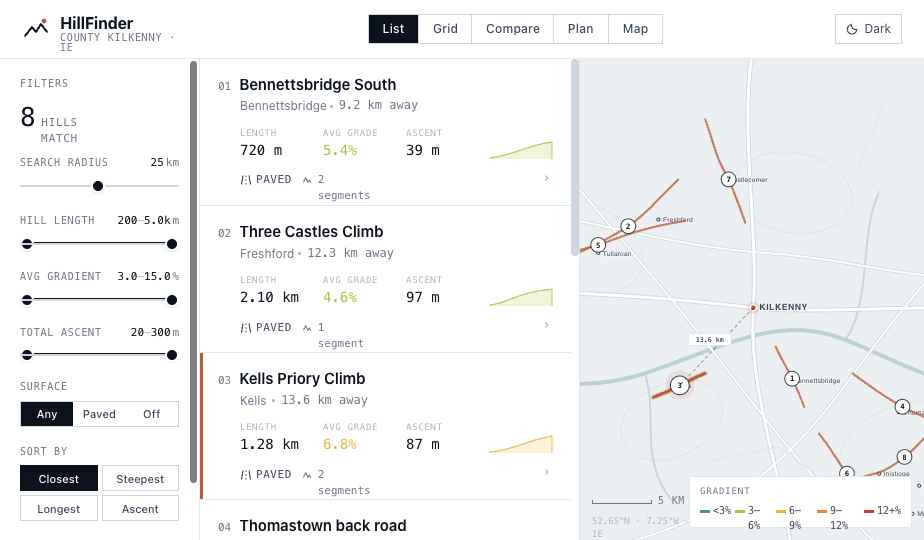

Two panes: scrollable hill cards (380px left) + interactive map (flex right). Hovering a card highlights its polyline + pin on the map; hovering the map highlights the corresponding card. A dashed line draws from "you" (Kilkenny city centre) to the hovered hill's pin, with the km rendered in a mono label.

Each card shows:
- Numeric prefix (`01`, `02` ... mono)
- Hill name (15px, 600 weight)
- Area + distance ("Bennettsbridge · 9.2 km away")
- 3-column stat row: Length, Avg Grade (colour-coded by grade band), Ascent
- Inline 64×20 sparkline (filled silhouette + 1.2px line, coloured by avg grade band)
- Surface chip (Paved / Unpaved with icon) + Strava segment count badge

#### Mode: Grid

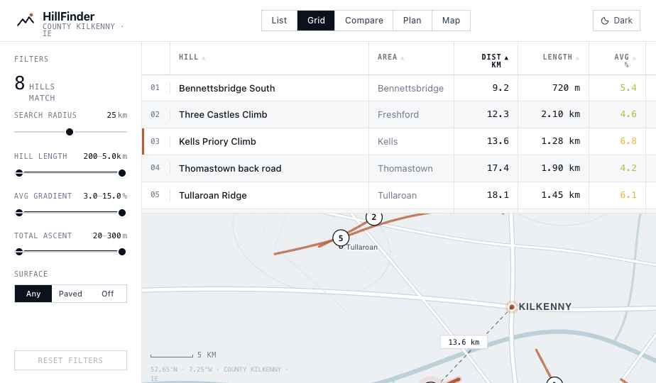

Sortable spreadsheet of every metric. Columns: row-number, Hill, Area, Dist km, Length, Avg %, Max %, Ascent m, Surface, Seg. (Strava count). Column headers are clickable; each column has a default direction (`asc` for name/area/dist/surface, `desc` for length/grade/ascent/segments). Click flips direction. Hover row highlights the row + the matching hill on a slim 240px map at the bottom.

#### Mode: Compare

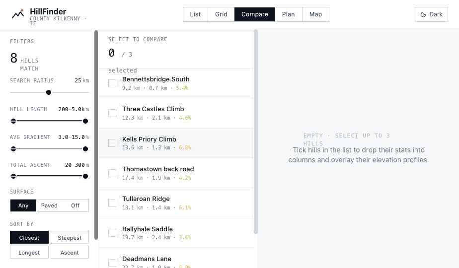

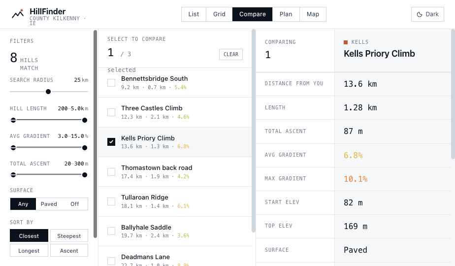

Two-pane: a slim list with checkboxes (320px left) + a side-by-side column panel (right). Pick up to 3 hills. Each selected hill drops in as a column with:
- Coloured indicator (terracotta / blue / green for hills 1/2/3)
- Name + area
- Stat rows: Distance, Length, Total Ascent, Avg Gradient, Max Gradient, Start Elev, Top Elev, Surface, Strava Segments
- **Overlaid elevation chart** at the bottom — all selected hills' profiles on shared x/y axes, line per hill

When zero are selected, show an empty state: "EMPTY · SELECT UP TO 3 HILLS · Tick hills in the list to drop their stats into columns and overlay their elevation profiles."

#### Mode: Plan (the key differentiator)

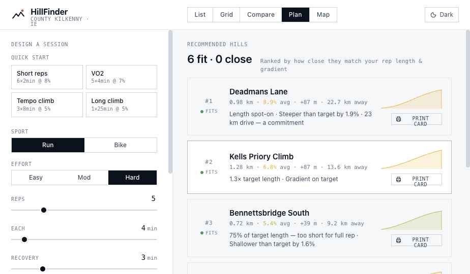

Workout-driven hill matching. Two-pane: planner form (340px left) + ranked results (right).

Form inputs:
- **Quick start templates**: Short reps, VO2, Tempo climb, Long climb (each pre-fills the form)
- **Sport**: Run / Bike (segmented)
- **Effort**: Easy / Mod / Hard (segmented)
- **Reps**: 1–20 (slider)
- **Each**: 1–45 min (slider)
- **Recovery**: 0–15 min (slider)
- **Target gradient**: 3–15% (slider)

Below the form, a **PER-REP BUDGET** panel computes:
- Ascent per rep
- Length per rep
- (Session total) Climb time, with recovery, total ascent

VAM (vertical ascent metres per hour) table for the budget heuristic:
```
run:  { easy: 600, moderate: 800, hard: 1000 }
bike: { easy: 700, moderate: 900, hard: 1100 }
```
`repAscent = VAM × repMin / 60`
`repLength = (repAscent / targetGrade) × 100`  (metres)

In the right pane: candidate hills filtered + scored by `lenDelta + gradeDelta`. Each match card shows:
- Rank number (#1, #2…)
- Fit badge (FITS green dot if length ≥ 70% of target AND grade within ±2.5%; CLOSE yellow otherwise)
- Hill name + stats line
- **Reasoning sentences** — concatenated: "Length spot-on · Steeper than target by 1.9% · 23 km drive — a commitment"
- Sparkline
- **PRINT CARD** button (see below)

#### Mode: Map (cartographer)

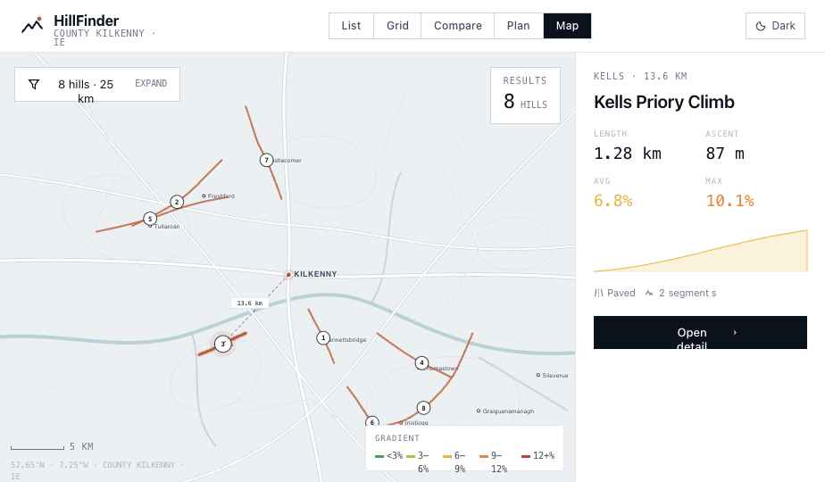

Full-bleed map. Floating chips:
- **Top-left**: filter chip (`8 hills · 25 km · EXPAND`) — clicking expands into a floating filter panel
- **Top-right**: results count card
- **Right rail (280px)**: shows hovered hill's full stat panel + sparkline + "Open detail" button. When nothing is hovered, shows the top 12 hills as a slim numbered list with grade chips.

### Screen 2: Detail

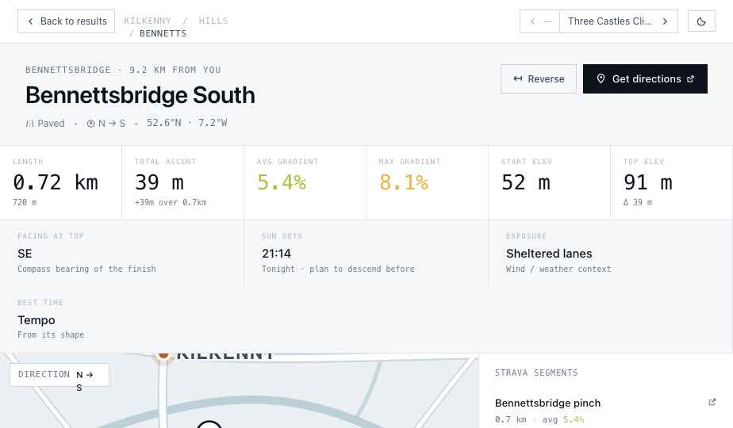

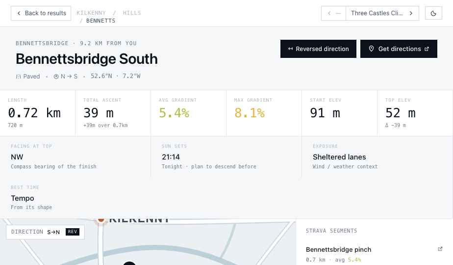

Top-to-bottom flow (no fixed-height container — flows with the viewport, page scrolls):

1. **Header** — Back to results · breadcrumb · prev/next nav (with hill names, not just arrows) · dark toggle
2. **Title block** — Area + distance eyebrow · H1 hill name · meta row (surface, direction, coords) · Reverse button + Get directions button
3. **Stats row** — 6 large mono stat cells: Length, Total Ascent, Avg Gradient, Max Gradient, Start Elev, Top Elev (with sub-line: `+39m over 0.7km`, etc.)
4. **Ambient strip** — 4 cells: Facing at top, Sun sets, Exposure, Best time (Hill reps / Sustained climb / Tempo, computed from shape)
5. **Map + Strava rail** — 360px map (1fr) with the climb shown as a gradient-coloured polyline (A/B markers at start/end), 320px Strava rail on the right
6. **Elevation profile** — 240px chart, distance on x, elevation on y, gradient-coloured fill quads between samples. Hovering the chart drops a vertical guide + a marker on the map at the corresponding point.
7. **Time-in-gradient breakdown** — horizontal stacked bar showing what % of the climb is in each gradient band, with legend below

### Interactions

- **List ↔ map hover sync** — both directions
- **Distance line** — dashed line + km label on map when any hill is hovered
- **Click anywhere on a list row, grid row, plan card, or map pin** → open detail
- **Filter changes** are live (no apply button)
- **Detail prev/next** — header buttons + keyboard ←/→
- **Esc** on detail → back to results
- **Reverse direction** on detail — mirrors the path, profile, and A/B markers; adds a REV chip on the map; recomputes stats from the reversed profile
- **URL hash state** — `#view=plan`, `#screen=detail&hill=brandon`, etc. Two-way sync with back button.

### Dark mode — the sun-setting transition

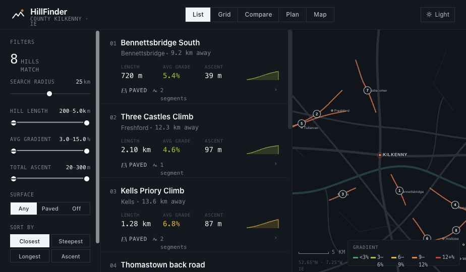

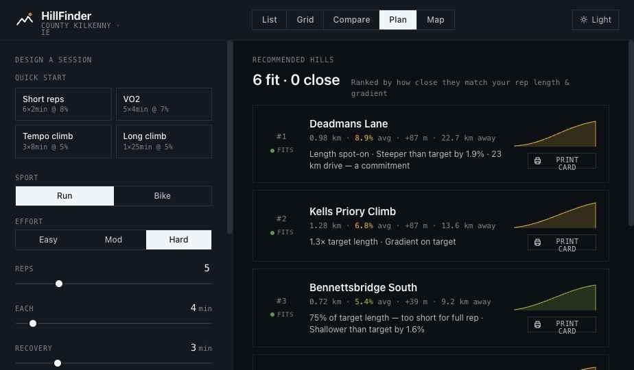

This is a delight feature. **Do not ship without it.**

When the user clicks the sun/moon icon, the following plays over 2.4 seconds:

1. A full-viewport overlay (`pointer-events: none`, `z-index: 9999`) is mounted and made visible.
2. Inside the overlay, two animated elements:
   - **`.sun-disc`** — a 92px radial-gradient circle (cream → gold → amber → ember) with two `drop-shadow` filters for the halo bloom
   - **`.sun-sky`** — a 200vw × 200vh element (centred via negative margin) with a radial-gradient (gold near centre → magenta → indigo → night-blue at edges)
3. Both elements animate via **Web Animations API** (not CSS @keyframes — see "Engineering pitfalls" below) along a parabolic 6-keyframe path:
   - `(95vw, 12vh)` → `(72vw, 22vh)` at 30% → `(50vw, 42vh)` at 55% → `(28vw, 72vh)` at 78% → `(14vw, 96vh)` at 92% → `(6vw, 118vh)` at 100%
   - Easing `cubic-bezier(0.45, 0.05, 0.55, 1)`
   - Slow descent at top of sky, accelerating as it nears horizon, dipping below the bottom edge
4. At **t = 1450ms** (60% through), the `html.dark` class is toggled. A scoped universal-transition rule applies a 1.1s `cubic-bezier(.4,0,.4,1)` transition on `background-color / color / border-color / fill / stroke` to every element matching `:where(body, header, aside, main, section, footer, h1–h4, p, span, a, button, input, label, li, ul, ol, div, svg, path, rect, circle, line, text, polygon, polyline, ellipse, g)`. The underlying UI smoothly interpolates between palettes behind the moving sun.
5. At **t = 2500ms**, the overlay is hidden and the `transitioning` class removed.

A subtle bottom horizon band (`linear-gradient(to top, rgba(12,14,30,0.55), transparent)` over 36vh) further darkens the sky as the sun approaches the bottom.

Sunrise reverses the same arc.

**Implementation file**: see `src/app.jsx` `toggleDark()` and the associated `useEffect` — it's a state-driven effect, not an event-handler ref dance.

### Printable workout card

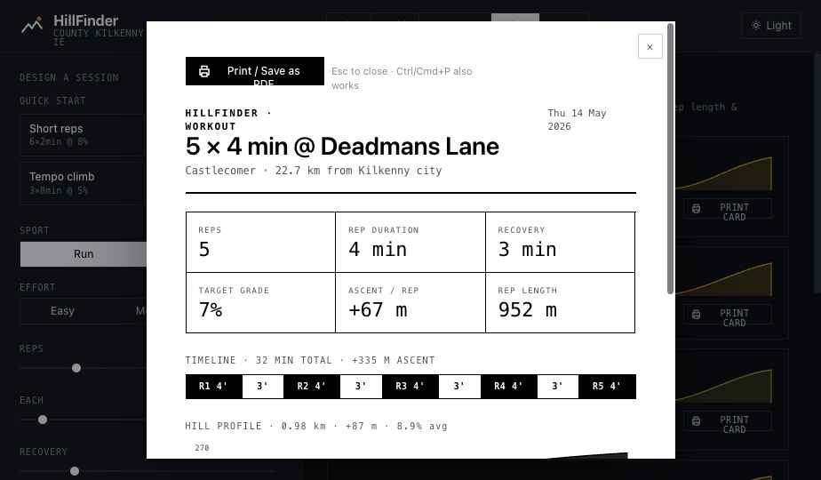

Triggered from a `PRINT CARD` button on any recommended hill in Plan mode. Renders an A5 portrait card with:
- Top band: "HILLFINDER · WORKOUT" eyebrow + date + H1 title ("5 × 4 min @ Deadmans Lane") + area+distance
- 6-stat grid: Reps, Rep duration, Recovery, Target grade, Ascent / rep, Rep length
- **Timeline visualisation** — horizontal bar split into proportional black/white blocks: work blocks ("R1 4'", "R2 4'", …) and rest blocks ("3'"), scaled by minute count, with the total beneath ("32 MIN TOTAL · +335 M ASCENT")
- Hill profile sketch (monochrome silhouette + axis labels)
- Coach notes: warm-up, rep effort, recovery, cool-down
- Footer: location + bearing

`window.print()` strips all chrome (`@media print` hides everything except the card overlay). The page sets `@page { size: A5 portrait; margin: 0 }`.

### Engineering pitfalls discovered during prototyping

These cost us time. Skip them.

1. **`@property` custom-property keyframes did not interpolate** in our Chromium build despite the spec saying they should. Animating `transform: translate(...)` keyframes directly via CSS @keyframes also failed when the universal transition rule used `*` selector. **Solution**: Use `element.animate([{...}], {...})` (Web Animations API) directly from a `useEffect`, not CSS animations. WAAPI bypasses the CSS cascade entirely.
2. **React refs are unreliable across the state-update-then-animate cycle.** Use `document.querySelector('.sun-disc')` from inside the effect; the elements are mounted on initial render (only their opacity is 0 via the parent).
3. **Universal transition rule must NOT use `*`.** Use `:where(body, header, ...)` to keep specificity low and to scope it away from the sun-sweep descendants. Override on `.sun-sweep`, `.sun-sky`, `.sun-disc` with `transition: none !important`.

---

## File Map (prototype)

The prototype is split into small JSX files. Each can be read in isolation.

| File | What it contains |
|---|---|
| `HillFinder.html` | Entry point. CSS variables, theme classes, sun-sweep CSS, script tag manifest. |
| `src/data.jsx` | Hill fixtures (12 hills in County Kilkenny), `buildProfile()` to synthesise elevation profiles, `filterHills()`, `sortHills()`, `gradeColorHex()`, `hillAmbient()` |
| `src/icons.jsx` | Inline SVG icon components |
| `src/themes.jsx` | Three themes (`paper`, `wayfinder`, `race`); only `paper` is shipped. Theme background components (PaperBackground, WayfinderBackground, RaceBackground). |
| `src/topomap.jsx` | The hand-drawn topographic SVG map. Contour layer, river, roads, settlements, hill polylines, pins, user location, distance line, scale bar, gradient legend. |
| `src/profile.jsx` | `<Sparkline>` (inline) and `<ElevationProfile>` (full chart with gradient-coloured fill quads and hover marker) |
| `src/filter-rail.jsx` | The 260px left filter rail used by List/Grid/Compare modes. Dual-handle ranges, single-handle slider, segmented chips. |
| `src/mode-switcher.jsx` | The 5-mode header pill |
| `src/grid.jsx` | Sortable spreadsheet view |
| `src/compare.jsx` | Multi-select pick list + side-by-side columns + overlaid elevation chart |
| `src/plan.jsx` | Session planner form + ranked results with reasoning blurbs |
| `src/mapfirst.jsx` | Full-bleed map mode with floating filter + right rail |
| `src/results.jsx` | Results screen orchestrator (header, mode routing, list-mode body) |
| `src/detail.jsx` | Detail page (title, stats row, ambient strip, map+strava, elevation profile, gradient breakdown, reverse toggle) |
| `src/workout-card.jsx` | Printable A5 workout card overlay (triggered from Plan mode `PRINT CARD` buttons) |
| `src/app.jsx` | Root app — state, URL hash sync, dark-mode WAAPI transition, prev/next nav |

---

## Production engineering — what to build

The prototype is UX-complete. Production needs **four substantial pieces** that the prototype mocks:

### 1. Hill detection pipeline

The prototype has 12 hand-curated fixtures. Real app needs hundreds-to-thousands of hills detected automatically from the road network.

**Inputs:**
- **OpenStreetMap road network** — fetched via Overpass API or downloaded from Geofabrik regional extracts. Filter to public roads (highway tags: motorway/trunk/primary/secondary/tertiary/unclassified/residential — exclude footways/cycleways unless explicitly desired).
- **Digital Elevation Model (DEM)** — for Europe: [Copernicus 30m EU-DEM](https://land.copernicus.eu/imagery-in-situ/eu-dem) (free, 30m resolution, sufficient for hill detection). Global fallback: SRTM 30m.

**Process:**
1. Sample each road every ~25m and look up elevation from the DEM (use [`rasterio`](https://rasterio.readthedocs.io/) in Python).
2. Walk the road computing a running gradient over a sliding window (e.g. 200m).
3. Emit a "climb segment" whenever the rolling gradient exceeds a minimum threshold (~3%) for a minimum distance (~200m).
4. Merge adjacent segments that share a continuous uphill direction.
5. For each detected climb, compute: avg gradient, max gradient (over 50m window), total ascent, length, start/end coordinates, surface (from OSM tags), nearest place name (reverse geocode).
6. Output as GeoJSON or import to PostGIS.

Open-source references to study:
- [climb-detector by Stéphane Mahut](https://github.com/SMahut/climb-detector) (Python, basic)
- [Climbfinder.com](https://climbfinder.com) — closest commercial product to HillFinder; study how they categorise climbs
- [VeloViewer](https://veloviewer.com)'s segment processing
- [cycle.travel](https://cycle.travel) — open-source UK climb data

**Output schema (minimal):**
```typescript
interface Hill {
  id: string;                    // slug
  name: string;                  // human-readable, often "<Road name> climb" or "<Place> Hill"
  area: string;                  // nearest settlement
  startCoord: [lon, lat];
  endCoord:   [lon, lat];
  polyline:   [[lon, lat], ...]; // sampled at ~25m
  lengthM:    number;
  avgGrade:   number;            // %
  maxGrade:   number;            // % over best 50m
  ascentM:    number;
  startEle:   number;            // m
  topEle:     number;            // m
  surface:    'paved' | 'unpaved';
  direction:  string;            // e.g. "SE → NW (ascending NW)"
  profile:    Array<{d: number, ele: number, grade: number}>;  // ~30 samples
}
```

Pre-compute the profile array — it's used by the client for the elevation chart and time-in-gradient breakdown.

### 2. Map tiles

The prototype uses a hand-drawn SVG topo map. Production needs a real basemap.

**Recommended**: **MapLibre GL JS** + **MapTiler vector tiles** (free tier: 100k tile requests/month). Custom-style the basemap to match the Field Journal aesthetic — desaturated, hairlines, monochrome labels — using MapTiler's [Customize](https://cloud.maptiler.com/maps/) tool. Hill polylines overlay as a GeoJSON source with a `gradient`-coloured line layer.

Alternatives:
- **Mapbox** (more polished, more expensive)
- **Stadia Maps** (free for non-commercial, paid commercial)
- **OpenFreeMap** (free, self-hosted vector tiles — best long-term option but more ops work)

Avoid raster tiles — they don't style cleanly and won't match the design's hairline aesthetic.

The hill's gradient-coloured polyline is drawn client-side: split the polyline into per-segment lines and colour each by its grade band. MapLibre supports this via `line-gradient` paint with a calculated expression, or as separate layers per band.

### 3. Strava integration

The Strava section on the detail page shows segments that overlap the climb's polyline.

**Strava Segments API** flow:
1. OAuth (required even for public segments). [Authorisation flow docs](https://developers.strava.com/docs/authentication/).
2. For each detected climb, call [`/segments/explore`](https://developers.strava.com/docs/reference/#api-Segments-exploreSegments) with the bounding box, filtering `activity_type=riding` (or `running`).
3. Cache aggressively — Strava rate limit is 200 requests / 15 min, 2000 / day for the app token. Refresh per-hill once per day at most.
4. Store: segment id, name, distance, average grade, link URL. Don't re-host map data.

If no segments are found, show the empty state: *"No Strava segments on this hill — you might be the first."*

### 4. Geolocation + "centre on…"

Prototype hard-codes "centre on Kilkenny city, 52.654°N 7.244°W". Production needs:

1. **HTML5 Geolocation prompt** on first visit (or "Use my location" button). Cache the result in localStorage.
2. **Manual override** — a place picker in the header (`"Centred on …"`). Use Nominatim or MapTiler Geocoding for autocomplete.
3. **Drag-the-pin** — on the Map mode, let the user drag the "you" marker to recenter. All distance calculations re-run.
4. **Distance calculation** — Haversine formula between user lat/lon and hill start lat/lon. Display in km, 1 decimal.

The `radius` filter then becomes "hills whose start point is within X km of the user pin."

---

## Out of scope for v1

Confirmed explicitly out of scope by the user:
- Account / login
- Saving favourite hills
- Route planning between hills
- Search by place name (manual override is fine; full place search is not)
- Anything social (comments, achievements, sharing to feeds)

---

## Build order

If shipping incrementally, build in this order:

**Phase 1 — MVP** (validate the core need)
- Hill detection pipeline for Kilkenny only
- Map tiles + custom style
- List mode + Detail page (without ambient strip, reverse, prev/next)
- Filter rail with the four sliders + surface + sort
- Geolocation + radius distance calc

**Phase 2 — Polish the discovery loop**
- Grid mode (sortable spreadsheet)
- Distance line on hover, prev/next on detail, URL hash state
- Reverse direction toggle
- Strava segments integration

**Phase 3 — The differentiator**
- Plan mode with VAM-based budget calc and reasoning blurbs
- Printable workout card

**Phase 4 — Delight**
- Sun-setting dark mode transition
- Compare mode
- Map-first mode
- Ambient strip (sunset time, exposure heuristic — needs weather + astronomy API integration)

---

## Open questions / decisions for the dev

1. **Hosting** — Frontend can be static (Vercel / Netlify / Cloudflare Pages). The hill database is read-only after the pipeline runs; serve as a static GeoJSON file or via a thin API. Strava cache needs a backend (Cloudflare Workers + KV is a good fit).
2. **Region scope** — Start with Kilkenny. The pipeline scales to any region with OSM + a DEM. Plan for `?region=ie-kilkenny` URL pattern.
3. **Mobile** — The prototype is responsive but Grid mode and Plan mode need a dedicated mobile pass before shipping. Below ~700px, default to List or Map. The product is "drive somewhere, run it" — phone usage is the default. Spend real effort here.
4. **Tweaks panel** — was used during design exploration; not shipped. Ignore `src/tweaks.jsx` (deleted) and any `__edit_mode_*` postMessage protocol references in `src/app.jsx`.
5. **Themes** — `src/themes.jsx` contains two unused themes (Wayfinder, Race Engineering) that were explored and rejected. Ship only `theme: "paper"` + `palette: "slate"`. The other branches can be deleted.

---

## Reference: Komoot / Strava / AllTrails

The visual references during design were:
- **Komoot's route detail page** — elevation profile with gradient colouring, map alongside
- **Strava segment pages** — stats density, leaderboard-style info layout
- **AllTrails' trail list view** — filters + list + map split

**Do not reproduce these companies' UI verbatim.** The Field Journal aesthetic in this prototype is intentionally original and should remain so.

---

Questions during implementation: ping back with the specific screen + state you're stuck on. The prototype is the source of truth for any visual or interaction question.
